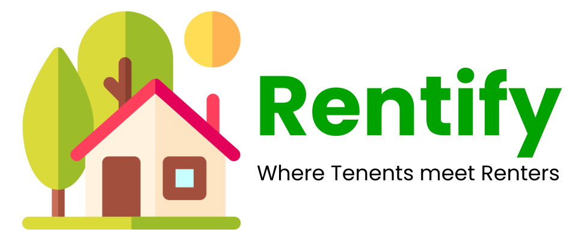
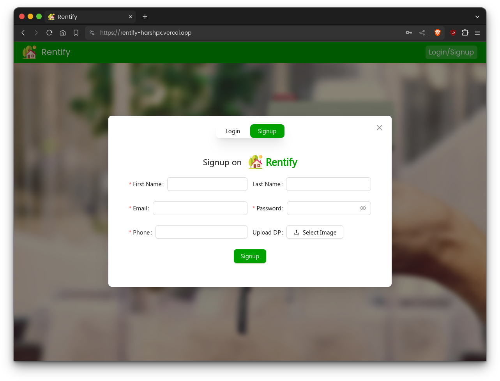
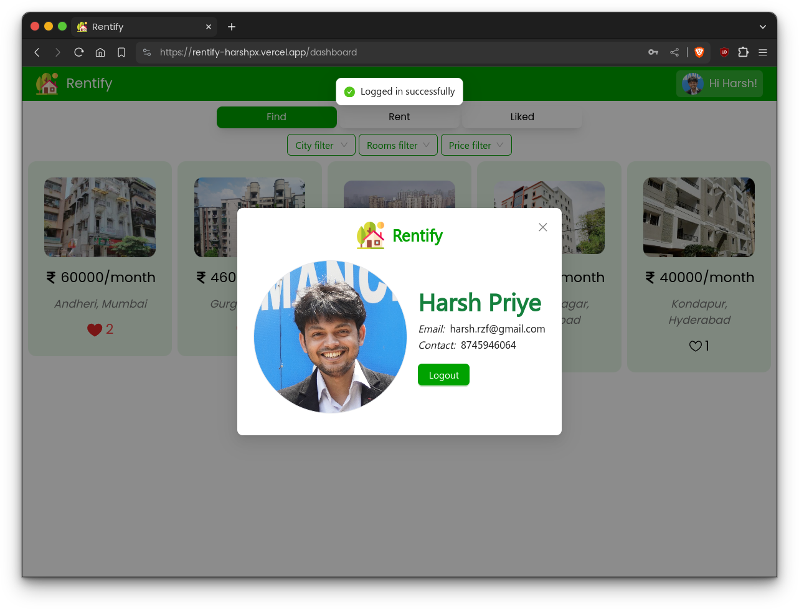
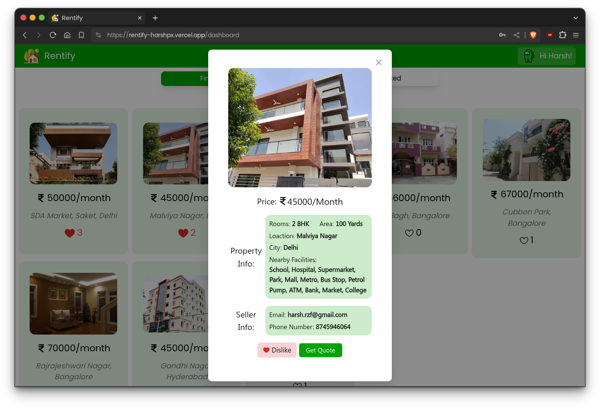
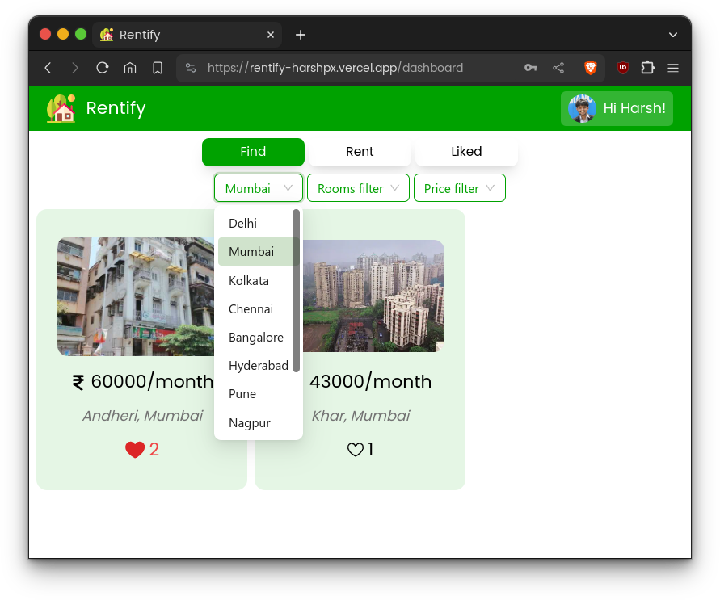
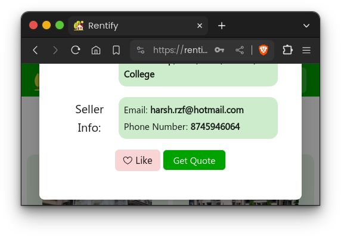
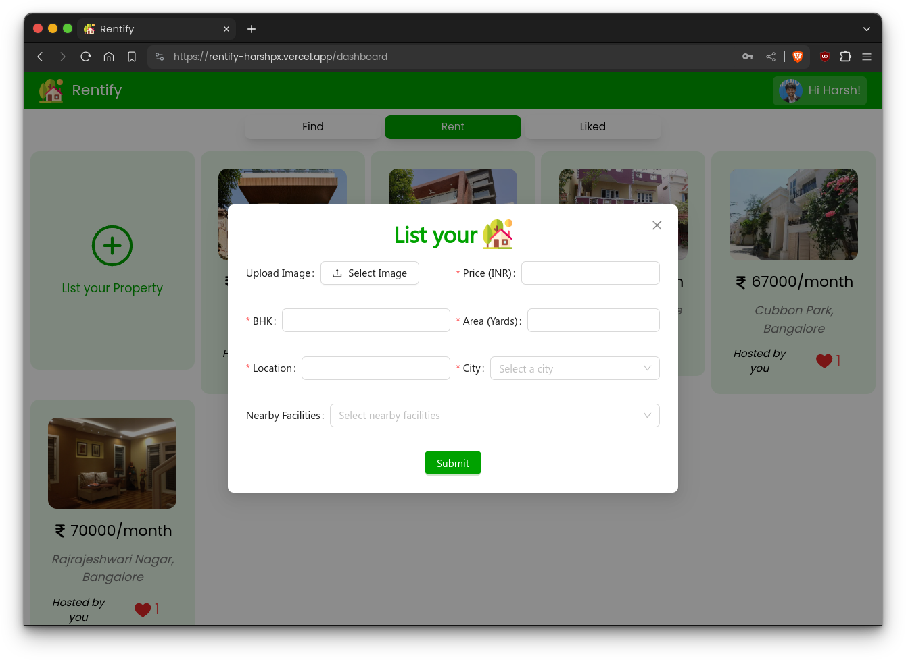
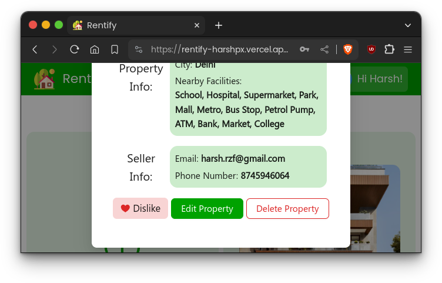
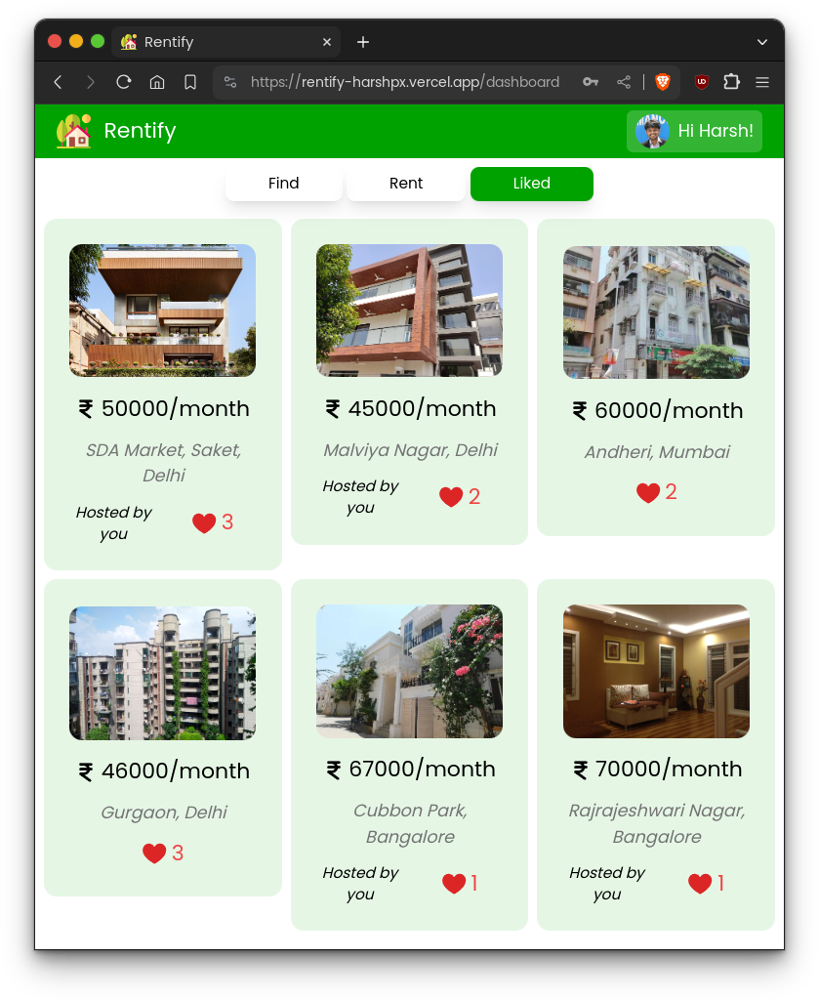

### Rentify is a marketplace for people in search for houses for rent in major indian cities. It allows renters/property owners to list their properties on the page, and tenants can reach out to them using this platform.

## Tech Stack

#### Rentify is a Full-Stack Web Application developed with <ins>Mongo, Express, React, Node (MERN) Stack</ins>
<div style="font-size:20px">


</div>

#### Alongwith <ins>Tailwind CSS</ins> and <ins>Ant Design</ins> styling libraries
<div style="font-size:20px">


</div>

#### And Cloudinary & EmailJS for Image Storage and Mailing Service respectively
<div style="font-size:20px">


</div>


## Deployment
### This app is deployed on: [https://rentify-harshpx.vercel.app/](https://rentify-harshpx.vercel.app/)

## To run locally
1. Clone Project:
    ```
    git clone https://github.com/harshpx/Rentify.git
    cd Rentify
    ```
2. Client setup:
    * Basic setup:
        ```
        cd client
        npm i
        ```
    * If you want Quote Emailing functionality: Setup EmailJS variables in `.env` file inside client dir (get these variables from your EmailJS profile)
        * VITE_EMAILJS_SERVICE_NAME (Your EmailJS Service name)
        * VITE_EMAILJS_TEMPLATE_NAME (Your EmailJS Template name)
        * VITE_EMAILJS_PUBLIC_KEY (Your EmailJS Public Key)
    * If you want to setup server locally too (*Not Recommended), change server proxy in `vite.config.js` to use http proxy while sending requests to local server at port 5000.
        ```
        export default defineConfig({
            server: {
                proxy: {
                '/api': 'http://localhost:5000/'
                }
            },
            plugins: [react()],
        })
        ```
3. Server setup (Not necessary as server is already deployed on [link](https://rentify-server-harshpx.vercel.app), do only for learning purposes):
    * Go to server directory and install required libraries.
    * Create `.env` file similar to `.env_sample` present in directory 
    * Setup MongoDB Atlas and cloudinary to get following environment variables:
        ```
        //.env file//
        MONGO_URI=""
        CLOUDINARY_CLOUD_NAME=""
        CLOUDINARY_API_KEY=""
        CLOUDINARY_API_SECRET=""
        PORT=5000
        JWT_SECRET="" (can be set aynthing accordingly)
        ```
    ```
    cd server
    touch .env
    //now fill details in .env file//
    npm i
    ```


## Features
* Register/Login to our platform<br/>



* Browse and explore properties (available in select cities)<br/>
 

* Apply filters to enhance your property search<br/>
 

* Get Quote on your email about the property you are interested in or Like/Dislike a property


* List your property <br/>
 

* Edit/Delete listed property <br/>
 

* Get your liked properties at one place<br/>
 